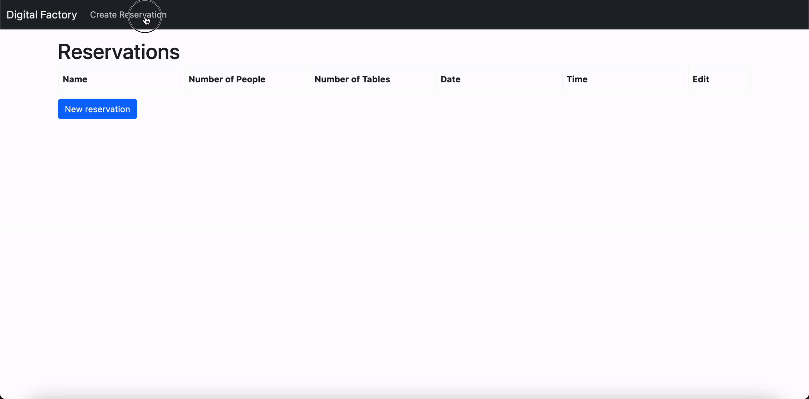
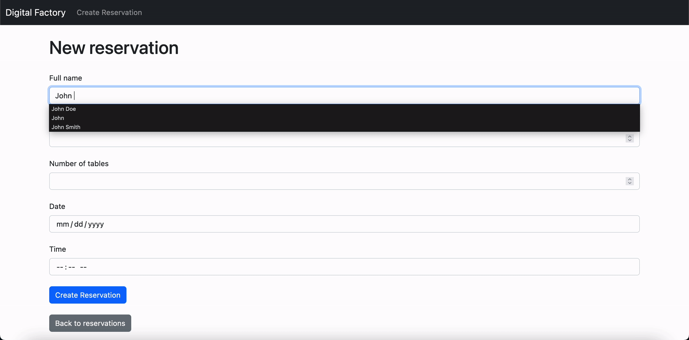
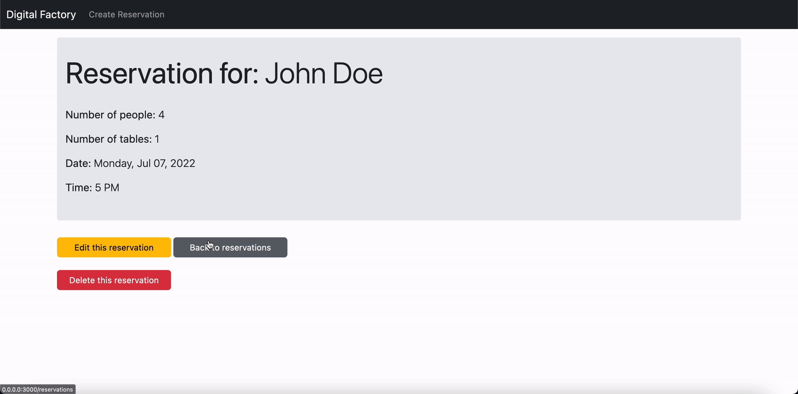
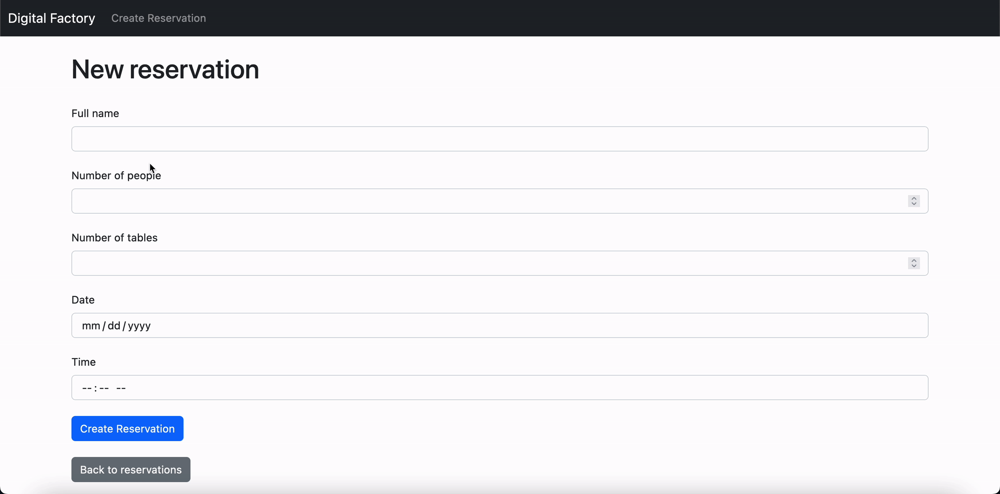
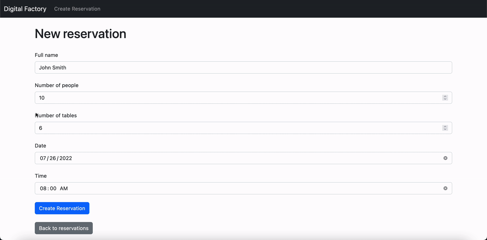

# README
This is a simple restaurant reservations system web application which allows restaurant employees 
to take reservation orders over the phone and input them manually into the application to keep a 
digital track of their availability.

The application was implemented using the following:
* Ruby version 2.7.5
* Rails version 7.0.3.1
* Bootstrap v5.2.0

Navigation:

Form Submission Success:

Form Edit Success:

Blank Form Submission Errors:

Wrong Date Submission Error:

Table Limit Exceeded Error:

